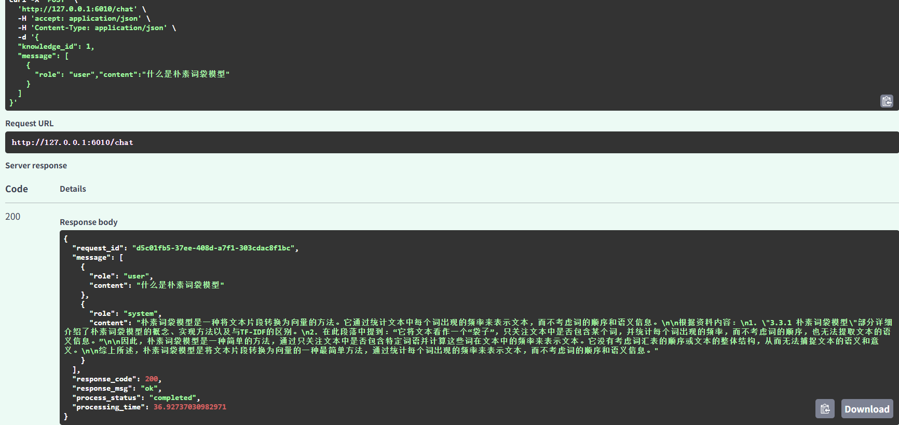

# 基于 RAG 的知识库智能问答系统

一个本地部署的 RAG 智能问答系统，支持 PDF 文档上传、自然语言提问、多轮对话。



## 技术栈

**后端**：FastAPI / Elasticsearch / MySQL（默认，可切 SQLite）/ Ollama / SBert / BM25 / pdfplumber

**认证与权限**：JWT（access + refresh）/ RBAC 角色权限 / 多租户数据隔离

**异步任务**：Celery + Redis（文档解析脱离 API 进程，服务重启不丢任务）

## 项目结构

```
.
├── main.py              # FastAPI 入口，REST API 端点
├── rag_api.py           # RAG 核心逻辑：检索、召回、重排、多轮对话
├── db_api.py            # 数据库层：MySQL（默认）/ SQLite 双引擎
├── es_api.py            # Elasticsearch 操作：向量索引、全文检索、级联删除
├── logging_config.py    # 日志底座：统一格式 + request_id 注入 + 轮转文件
├── router_schemas.py    # API 请求/响应数据结构
├── security.py          # 认证与授权：密码哈希、JWT、权限依赖、租户过滤
├── auth_routes.py       # 认证接口：登录 / 刷新 / 当前用户 / 创建用户
├── celery_app.py        # Celery 应用（Redis 作为 broker / backend）
├── tasks.py             # 异步任务：文档解析入库（幂等投递 + 分层重试）
├── task_store.py        # 任务状态存储（task 表，可查询 / 可审计）
├── alembic/             # 数据库迁移（表结构版本管理）
├── scripts/             # 运维脚本（如 SQLite → MySQL 数据搬迁）
├── config.yaml          # 配置：数据库、ES、模型路径、LLM
├── upload_files/        # 上传的 PDF 文件
├── test/                # 单元测试
│   ├── benchmark_report.py         # RAG 评测脚本（召回率 / 准确率）
│   └── benchmark_cases_rag_book.py # 评测用例（50 条，三档难度）
```

## 快速开始

### 环境要求

- Python 3.10+
- Elasticsearch 8.x
- MySQL 8.x（默认数据库；也可改用本地 SQLite）
- Ollama（本地运行 LLM）

### 启动服务

```bash
# 1. 启动 Elasticsearch
# 2. 启动 Ollama 并确保 qwen2.5:1.5b 模型已拉取
ollama pull qwen2.5:1.5b
ollama serve

# 3. 首次运行 / 拉取新代码后，先同步数据库表结构
alembic upgrade head

# 4. 创建初始管理员（接口要求管理员权限，第一个管理员由脚本初始化）
python scripts/create_user.py --username admin --password 'Admin@12345' --role admin --department-id 1

# 5. 启动 Redis（异步任务队列的 broker）
docker run -d --name rag-redis -p 6379:6379 -v rag_redis_data:/data redis:7 redis-server --appendonly yes

# 6. 启动后端
python main.py

# 7. 另开窗口启动 Celery worker（Windows 必须加 -P solo）
celery -A celery_app worker -l info -P solo
```

- 后端运行在 `http://localhost:6010`
- 接口文档（Swagger UI）在 `http://localhost:6010/docs`
- 数据库默认 MySQL，本地密码写在 `.env`（不会提交）；改 `.env` 的 `RAG_DB_ENGINE` 可切回 SQLite

## 核心功能

### 1. 文档上传与解析

上传 PDF 文档，系统自动：
- 提取页面文本和表格
- 处理跨页断句
- 按 256 字符分块（中文 1 字 ≈ 1 token），20 字符重叠
- 批量生成 BGE 向量
- 写入 ES 索引

### 2. 双路并行召回

检索时同时执行两路搜索：

```
用户问题 → Query 改写（结合历史理解指代）→ Embedding
                        ↓
              ┌─────────┴─────────┐
              ↓                   ↓
         BM25 检索            KNN 向量检索
              ↓                   ↓
              └─────────┬─────────┘
                        ↓
                  RRF 融合（k=60）
                        ↓
                  重排序（可选）
                        ↓
                     返回结果
```

- **BM25**：关键词精确匹配
- **KNN**：向量相似度检索
- **RRF**：Reciprocal Rank Fusion，两路结果按排名融合
- **重排序**：bge-reranker-base Cross-Encoder 精排
- **进 Prompt 条数**：召回/重排 10 条候选，最终只保留前 5 条（`rerank_top_k`）

### 3. 多轮对话

每轮对话基于最新问题重新检索，结合对话历史生成回答。

### 4. 检索中间结果可视化

`/chat` 接口返回 `debug_info` 字段，包含：
- **改写后 query**：LLM 消除指代后的检索用 query
- **召回文档块列表**：每条含来源文档 ID、页码、RRF 融合分数、重排分数、内容片段
- 调 `debug_info` 即可拿到检索详情（Swagger `/docs` 或任意客户端均可查看）

### 5. 引用溯源

每轮回答下方显示引用的文档来源，标注文档 ID、页码，支持展开查看原文片段。

### 6. 异步处理

PDF 上传后立即返回，解析任务投递到 Redis 队列，由独立 worker 进程执行：

- API 只负责"存元数据 + 落盘 + 投递任务"，不被向量化拖慢；
- `acks_late=True`：worker 执行完才 ack，**worker 崩溃或服务重启任务会自动重新投递**；
- 分层重试：函数内重试处理瞬时抖动，任务级重试（指数退避）处理进程级故障；
- 任务状态写入 `task` 表，可用 `GET /v1/task?task_id=...` 查询（pending → started → success / failure）。

### 7. 数据一致性（级联删除）

系统数据横跨 MySQL（元数据）、Elasticsearch（分块向量 + 摘要）、磁盘（PDF）三处，没有事务边界。删除采用**级联清理**，顺序钉死为「**ES 先删（失败阻断）→ 物理文件次删（失败只告警）→ 数据库最后删（同一事务）**」：

- **删文档**按 `document_id` 精确删，只清该文档的 ES 分块/摘要、PDF 和元数据行
- **删知识库**按 `knowledge_id` 一把清，连子文档行和所有 PDF 一起清理，不误删其他库
- ES 删除失败整体失败（返回 500、数据库不删），**绝不留半删状态**（删完还能搜到"幽灵分块"）
- `delete_by_query` 显式检查 `version_conflicts`/`failures`，部分删除失败也会报错

### 8. 结构化日志与监控

基于 Python 标准库 `logging`，所有服务端日志统一格式，可筛、可查、可串起一次请求：

- **request_id 关联**：HTTP 中间件为每个请求生成唯一 ID，经 `contextvars` 贯穿整条调用链，业务日志自动携带
- **请求耗时**：中间件记录 `方法 路径 -> 状态码 | 耗时`
- **检索链路耗时拆分**：改写 / 向量 / 召回 / 重排四段独立计时，一眼定位"回答慢在哪一步"
- **脱敏**：对话全文、prompt 全文不落日志，只记长度，避免敏感内容泄露
- **日志轮转**：`rag.log` 5MB 轮转、保留 3 份，防止无限膨胀

### 9. 效果评测（真实数字）

基于《大模型RAG实战》标注了 **50 条评测用例**（easy 13 / medium 25 / hard 12），对三种召回方式跑三个口径：

| 方式 | 关键词命中 | 答案块命中 | MRR@5 |
| --- | --- | --- | --- |
| BM25 | 96.0% | 88.0% | 0.767 |
| 向量 | 98.0% | 86.0% | 0.762 |
| **融合(RRF+重排)** | 98.0% | **94.0%** | **0.870** |

- **关键词命中**（弱口径）：Top-5 文本中出现任一标注关键词；
- **答案块命中**（严格口径）：答案块本身（用特征词在知识库中定位的 ES 文档 ID）是否出现在 Top-5；
- **MRR@5**：答案块在结果中的最佳排名的倒数均值，衡量排序质量而非单纯命中。

回答准确率（5 条题，Ollama 真实生成）：无重排 **53.3%** → 有重排 **66.7%**（+13.3%），验证 bge-reranker 的价值。

> 运行前提：ES 已启动、知识库已建好且文档已解析完成；确认 `benchmark_report.py` 中的 `KB_ID` 与你的知识库一致。
> `pytest test/benchmark_report.py -v -s -k recall` 跑召回率（需 ES + 模型）；`-k accuracy` 跑回答准确率（需 Ollama）。

## API 端点

| 方法 | 路径 | 说明 |
|------|------|------|
| POST | `/v1/auth/login` | 登录，返回 access + refresh token（无需认证） |
| POST | `/v1/auth/refresh` | 用 refresh token 换新 token |
| GET | `/v1/auth/me` | 当前用户信息 |
| POST | `/v1/auth/register` | 创建用户（仅管理员） |
| GET | `/v1/task` | 查询异步任务状态（按 task_id） |
| GET | `/v1/document/status` | 查询文档最近一次解析任务状态 |
| GET | `/v1/knowledge_base` | 查询知识库 |
| GET | `/v1/knowledge_base/list` | 知识库列表 |
| POST | `/v1/knowledge_base` | 创建知识库 |
| DELETE | `/v1/knowledge_base` | 删除知识库（级联清空库下 ES 分块/摘要 + PDF + 子文档） |
| GET | `/v1/document` | 查询文档 |
| GET | `/v1/document/list` | 文档列表（按知识库） |
| POST | `/v1/document` | 上传 PDF（异步解析） |
| DELETE | `/v1/document` | 删除文档（级联清理 ES 分块/摘要 + PDF） |
| POST | `/v1/embedding` | 文本向量化 |
| POST | `/v1/rerank` | 重排序 |
| POST | `/chat` | RAG 多轮对话（含 debug_info 检索详情） |

## 认证与权限（JWT + RBAC + 多租户）

### 初始化管理员

`/v1/auth/register` 需要管理员权限，所以第一个管理员用脚本创建（企业里通常也由运维初始化）：

```bash
python scripts/create_user.py --username admin --password 'Admin@12345' --role admin --department-id 1
```

### 登录获取 token

```bash
# OAuth2 密码流程（表单参数），返回 access_token（30 分钟）与 refresh_token（7 天）
curl -X POST "http://localhost:6010/v1/auth/login" \
  -d "username=admin&password=Admin@12345"
```

后续请求带上 `Authorization: Bearer <access_token>`；也可以直接用 Swagger `/docs` 右上角的 **Authorize** 按钮登录。

### 角色与权限

| 角色 | 权限范围 |
|------|----------|
| admin | 全部操作，可跨部门 |
| editor | 本部门知识库/文档增删改 + 问答 |
| viewer | 本部门只读 + 问答 |
| system | 通过 `X-API-Key` 调用（脚本 / CI），可跨部门 |

### 多租户隔离规则

- 创建知识库/文档时，`owner_id` / `department_id` 由服务端按当前登录用户写入，**请求体传的一律忽略**；
- 查询、列表、删除、问答全部强制按本部门过滤（admin / system 除外）；
- 跨部门访问与"资源不存在"统一返回 404，不泄露资源是否存在；
- ES 检索同样带 `department_id` 过滤，避免从向量/全文检索侧绕过隔离。

## 数据存储

| 存储 | 用途 |
|------|------|
| MySQL（默认）/ SQLite | 知识库、文档元数据的 CRUD |
| ES chunk_info | 文档块文本、全文索引、向量索引 |
| ES document_meta | 文档摘要、文件名等元数据 |

## 配置说明

关键配置在 `config.yaml`：

```yaml
rag:
  llm_base: "http://localhost:11434/v1"   # Ollama 地址
  llm_model: "qwen2.5:1.5b"              # LLM 模型
  embedding_model: "bge-small-zh-v1.5"   # Embedding 模型
  rerank_model: "bge-reranker-base"      # 重排模型
  chunk_size: 256                        # 分块大小
  chunk_overlap: 20                      # 重叠窗口
  chunk_candidate: 10                    # RRF 融合后召回候选数
  rerank_top_k: 5                        # 最终进 Prompt 的条数
```

## 测试

```bash
pytest test/ -v
```

RAG 评测（50 条用例 × 三口径）：

```bash
pytest test/benchmark_report.py -v -s -k recall     # 召回率：关键词 / 答案块 / MRR
pytest test/benchmark_report.py -v -s -k accuracy   # 回答准确率（需 Ollama）
```

## 数据库迁移（Alembic）

表结构由 Alembic 管理（代码不再 import 时自动建表），SQLite 与 MySQL 共用同一套迁移文件。

```bash
# 1. 新环境 / clone 后第一次启动前，先执行（默认迁本地 SQLite）
alembic upgrade head

# 2. 用 MySQL 时，先设好环境变量再执行同样命令：
#    RAG_DB_ENGINE=mysql / RAG_DB_USER=root / RAG_DB_PASSWORD=xxx / RAG_DB_NAME=rag
#    （PowerShell 里用 $env:RAG_DB_ENGINE='mysql' 的形式设置）
alembic upgrade head

# 3. 查看当前数据库处于哪个版本
alembic current

# 4. 修改 db_api.py 的模型后，生成迁移文件并执行
alembic revision --autogenerate -m "描述这次表结构改动"
alembic upgrade head

# 5. 回滚最近一次结构变更（后悔药）
alembic downgrade -1
```

> 存量库首次接入 Alembic 时用 `alembic stamp head` 打版本标签，不要对已有数据的库直接 upgrade。

> 本地数据库配置写在项目根目录的 `.env`（已被 .gitignore 忽略，密码不会提交），
> 启动时由 `db_api.py` 自动加载。优先级：环境变量 > `.env` > `config.yaml`。

## 项目亮点

1. **双路并行召回**：BM25 + KNN 通过 ThreadPoolExecutor 并行执行，降低检索延迟
2. **RRF 融合**：无需调参，用排名而非分数融合结果，避免量纲不一致问题
3. **Query 改写**：结合多轮对话历史，基于 LLM 消除指代消解与话题漂移，提升多轮对话检索准确性
4. **检索可视化**：`/chat` 返回 `debug_info`（改写后 query、召回片段、RRF/重排分数），便于排查检索质量
5. **引用溯源**：每轮回答关联来源文档片段，展示引用依据
6. **跨页断句处理**：保留页面边界语义完整性
7. **表格提取**：识别并存储 PDF 中的表格结构
8. **异步任务队列**：Celery + Redis 承载文档解析，任务状态落库可查，worker 崩溃 / 服务重启自动重投
9. **数据一致性级联删除**：三存储（MySQL / ES / 磁盘）无事务边界下，删除按「ES 先删（失败阻断）→ 文件次删（告警）→ 数据库最后删（同事务）」清干净，杜绝幽灵分块与孤儿数据
10. **结构化日志与监控**：request_id 串联整条请求链路，检索四段耗时拆分，敏感内容脱敏，5MB 轮转防膨胀
11. **评测体系**：50 条基于真实知识库文档的评测用例 + 三口径指标（关键词 / 答案块 / MRR），用数据验证双路融合与重排的价值
