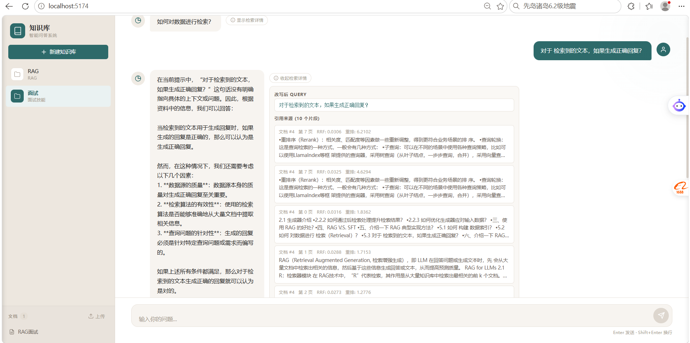

# 基于 RAG 的知识库智能问答系统

一个本地部署的 RAG 智能问答系统，支持 PDF 文档上传、自然语言提问、多轮对话。

 

## 技术栈

**后端**：FastAPI / Elasticsearch / SQLite / Ollama / SBert / BM25 / pdfplumber

**前端**：Vue 3 / Element Plus / Axios / Vite

## 项目结构

```
.
├── main.py              # FastAPI 入口，REST API 端点
├── rag_api.py           # RAG 核心逻辑：检索、召回、重排、多轮对话
├── db_api.py            # SQLite 操作：知识库、文档元数据
├── es_api.py            # Elasticsearch 操作：向量索引、全文检索、级联删除
├── logging_config.py    # 日志底座：统一格式 + request_id 注入 + 轮转文件
├── router_schemas.py    # API 请求/响应数据结构
├── config.yaml          # 配置文件
├── upload_files/        # 上传的 PDF 文件
├── rag.db               # SQLite 数据库
├── frontend/            # Vue 3 前端
│   ├── src/
│   │   ├── App.vue
│   │   ├── api.js
│   │   ├── components/
│   │   │   ├── Sidebar.vue
│   │   │   └── ChatView.vue
│   │   └── main.js
│   ├── vite.config.js
│   └── package.json
└── test/                # 单元测试
```

## 快速开始

### 环境要求

- Python 3.10+
- Elasticsearch 8.x
- Ollama（本地运行 LLM）

### 启动服务

```bash
# 1. 启动 Elasticsearch
# 2. 启动 Ollama 并确保 qwen2.5:1.5b 模型已拉取
ollama pull qwen2.5:1.5b
ollama serve

# 3. 启动后端
python main.py

# 4. 新开终端，启动前端
cd frontend
npm install   # 首次运行需要
npm run dev
```

- 后端运行在 `http://localhost:6010`
- 前端运行在 `http://localhost:5173`（Vite 开发服务器）

## 核心功能

### 1. 文档上传与解析

上传 PDF 文档，系统自动：
- 提取页面文本和表格
- 处理跨页断句
- 按 256 tokens 分块，20 overlap
- 批量生成 BGE 向量
- 写入 ES 索引

### 2. 双路并行召回

检索时同时执行两路搜索：

```
用户问题 → Query 改写（结合历史理解指代）→ Embedding
                        ↓
              ┌─────────┴─────────┐
              ↓                   ↓
         BM25 检索            KNN 向量检索
              ↓                   ↓
              └─────────┬─────────┘
                        ↓
                  RRF 融合（k=60）
                        ↓
                  重排序（可选）
                        ↓
                     返回结果
```

- **BM25**：关键词精确匹配
- **KNN**：向量相似度检索
- **RRF**：Reciprocal Rank Fusion，两路结果按排名融合
- **重排序**：bge-reranker-base Cross-Encoder 精排

### 3. 多轮对话

每轮对话基于最新问题重新检索，结合对话历史生成回答。

### 4. 检索中间结果可视化

`/chat` 接口返回 `debug_info` 字段，包含：
- **改写后 query**：LLM 消除指代后的检索用 query
- **召回文档块列表**：每条含来源文档 ID、页码、RRF 融合分数、重排分数、内容片段
- 前端以折叠面板展示，可展开查看检索详情

### 5. 引用溯源

每轮回答下方显示引用的文档来源，标注文档 ID、页码，支持展开查看原文片段。

### 6. 异步处理

PDF 上传后立即返回，解析任务后台执行，不阻塞 API。

### 7. 数据一致性（级联删除）

系统数据横跨 SQLite（元数据）、Elasticsearch（分块向量 + 摘要）、磁盘（PDF）三处，没有事务边界。删除采用**级联清理**，顺序钉死为「**ES 先删（失败阻断）→ 物理文件次删（失败只告警）→ SQLite 最后删（同一事务）**」：

- **删文档**按 `document_id` 精确删，只清该文档的 ES 分块/摘要、PDF 和元数据行
- **删知识库**按 `knowledge_id` 一把清，连子文档行和所有 PDF 一起清理，不误删其他库
- ES 删除失败整体失败（返回 500、SQLite 不删），**绝不留半删状态**（删完还能搜到"幽灵分块"）
- `delete_by_query` 显式检查 `version_conflicts`/`failures`，部分删除失败也会报错

### 8. 结构化日志与监控

基于 Python 标准库 `logging`，所有服务端日志统一格式，可筛、可查、可串起一次请求：

- **request_id 关联**：HTTP 中间件为每个请求生成唯一 ID，经 `contextvars` 贯穿整条调用链，业务日志自动携带
- **请求耗时**：中间件记录 `方法 路径 -> 状态码 | 耗时`
- **检索链路耗时拆分**：改写 / 向量 / 召回 / 重排四段独立计时，一眼定位"回答慢在哪一步"
- **脱敏**：对话全文、prompt 全文不落日志，只记长度，避免敏感内容泄露
- **日志轮转**：`rag.log` 5MB 轮转、保留 3 份，防止无限膨胀

## API 端点

| 方法 | 路径 | 说明 |
|------|------|------|
| GET | `/v1/knowledge_base` | 查询知识库 |
| GET | `/v1/knowledge_base/list` | 知识库列表 |
| POST | `/v1/knowledge_base` | 创建知识库 |
| DELETE | `/v1/knowledge_base` | 删除知识库（级联清空库下 ES 分块/摘要 + PDF + 子文档） |
| GET | `/v1/document` | 查询文档 |
| GET | `/v1/document/list` | 文档列表（按知识库） |
| POST | `/v1/document` | 上传 PDF（异步解析） |
| DELETE | `/v1/document` | 删除文档（级联清理 ES 分块/摘要 + PDF） |
| POST | `/v1/embedding` | 文本向量化 |
| POST | `/v1/rerank` | 重排序 |
| POST | `/chat` | RAG 多轮对话（含 debug_info 检索详情） |

## 数据存储

| 存储 | 用途 |
|------|------|
| SQLite | 知识库、文档元数据的 CRUD |
| ES chunk_info | 文档块文本、全文索引、向量索引 |
| ES document_meta | 文档摘要、文件名等元数据 |

## 配置说明

关键配置在 `config.yaml`：

```yaml
rag:
  llm_base: "http://localhost:11434/v1"   # Ollama 地址
  llm_model: "qwen2.5:1.5b"              # LLM 模型
  embedding_model: "bge-small-zh-v1.5"   # Embedding 模型
  rerank_model: "bge-reranker-base"      # 重排模型
  chunk_size: 256                        # 分块大小
  chunk_overlap: 20                      # 重叠窗口
```

## 测试

```bash
pytest test/ -v
```

## 项目亮点

1. **双路并行召回**：BM25 + KNN 通过 ThreadPoolExecutor 并行执行，降低检索延迟
2. **RRF 融合**：无需调参，用排名而非分数融合结果，避免量纲不一致问题
3. **Query 改写**：结合多轮对话历史，基于 LLM 消除指代消解与话题漂移，提升多轮对话检索准确性
4. **检索可视化**：前后端联动，前端可展开查看改写 query、召回片段、排序分数
5. **引用溯源**：每轮回答关联来源文档片段，展示引用依据
6. **跨页断句处理**：保留页面边界语义完整性
7. **表格提取**：识别并存储 PDF 中的表格结构
8. **任务状态机**：跟踪文档解析进度，指数退避重试保障可靠性
9. **数据一致性级联删除**：三存储（SQLite / ES / 磁盘）无事务边界下，删除按「ES 先删（失败阻断）→ 文件次删（告警）→ SQLite 最后删（同事务）」清干净，杜绝幽灵分块与孤儿数据
10. **结构化日志与监控**：request_id 串联整条请求链路，检索四段耗时拆分，敏感内容脱敏，5MB 轮转防膨胀